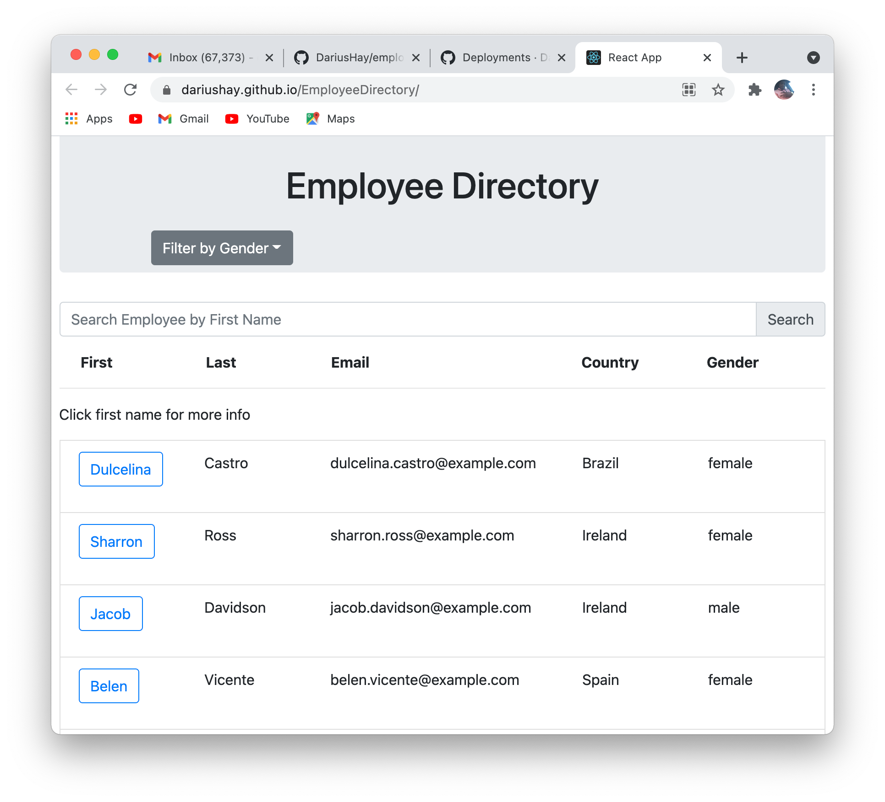
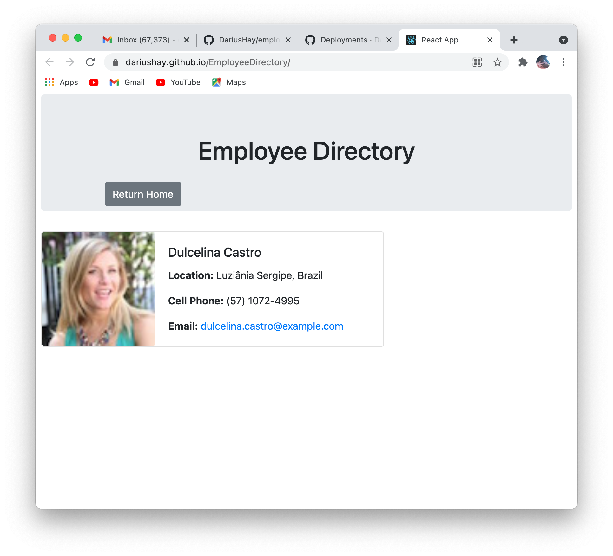

## Project Title

Employee Directory

## Description

This application allows the user to research a directory list of a company to find employee information. The user has the ability to view a list of all empoyees, filter the employees by gender, or search for individual employees by first name. The User can also click each employee's first name and view a small profile of that employee with a bit more information.

## Table of Content

1. [Installation requirements](#Installation)
2. [Screenshots](#Screenshots)
3. [Deployed](#Deployed)
4. [Contributions](#Contributions)
5. [Questions](#Questions)

## Installation

"axios", "react", "react-dom", "bootstrap 4.3.1"

## Screenshots

## Deployed 

https://dariushay.github.io/EmployeeDirectory/

## Contributions

Darius Hay https://github.com/DariusHay

## Questions

If you have any additional questions about this project, you can find me on GitHub at DariusHay https://github.com/DariusHay, or you can email me at dariushay@gmail.com, thank you.

